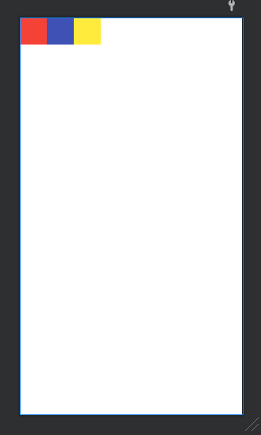
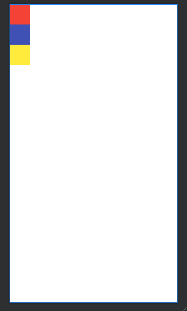
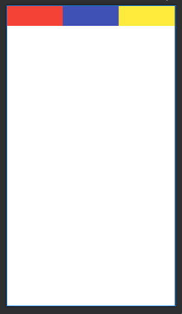
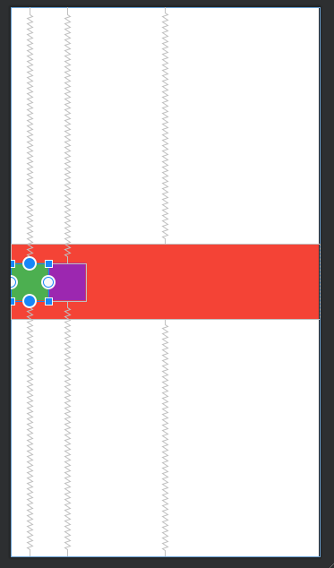
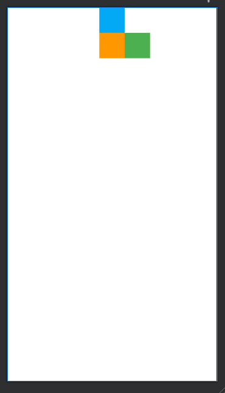

# Linear layout vs Relative layout vs Constraint layout

안드로이드 앱 개발을 하기 위해서 어떤 상황에서 어떤 레이아웃을 해야 효율적인지 결정해야 한다. 그러기 위해서는 개발할 때 가장 많이 사용하는 레이아웃 3개에 대해 알아봤다. 사실 이 3개만 알아도 웬만한 레이아웃은 다 짤 수 있다.

## 1. Linear layout

- 여러 개의 뷰 (View)를 위에서 부터 아래 또는 왼쪽에서 오른쪽으로 나열할 때 주로 사용된다.
- Orientaion 옵션을 통해 수평나열 또는 수직나열을 정할 수 있다.

```xml
<?xml version="1.0" encoding="utf-8"?>
<LinearLayout xmlns:android="http://schemas.android.com/apk/res/android"
    xmlns:app="http://schemas.android.com/apk/res-auto"
    xmlns:tools="http://schemas.android.com/tools"
    android:id="@+id/drawer_layout"
    android:layout_width="match_parent"
    android:layout_height="match_parent"
    tools:context=".MainActivity">

    <View
        android:layout_width="50dp"
        android:layout_height="50dp"
        android:background="#F44336"/>

    <View
        android:layout_width="50dp"
        android:layout_height="50dp"
        android:background="#3F51B5"/>

    <View
        android:layout_width="50dp"
        android:layout_height="50dp"
        android:background="#FFEB3B"/>


</LinearLayout>
```

  
위 코드는 LinearLayout에 아무런 orientaion 설정을 주지 않았다. 이러면 위의 결과사진처럼 default 값으로 수평으로 나열된다.

```xml
<?xml version="1.0" encoding="utf-8"?>
<LinearLayout xmlns:android="http://schemas.android.com/apk/res/android"
    xmlns:app="http://schemas.android.com/apk/res-auto"
    xmlns:tools="http://schemas.android.com/tools"
    android:id="@+id/drawer_layout"
    android:layout_width="match_parent"
    android:layout_height="match_parent"
    android:orientation="vertical"
    tools:context=".MainActivity">

    <View
        android:layout_width="50dp"
        android:layout_height="50dp"
        android:background="#F44336"/>

    <View
        android:layout_width="50dp"
        android:layout_height="50dp"
        android:background="#3F51B5"/>

    <View
        android:layout_width="50dp"
        android:layout_height="50dp"
        android:background="#FFEB3B"/>


</LinearLayout>
```

  
위 코드는 orientaion=vertical 설정을 주었다. 이러면 위의 결과사진처럼 수직으로 나열된다.

- 가중치 (weight)를 통해서 자식 뷰를 일정 비율로 그릴 수 있다.

```xml
<?xml version="1.0" encoding="utf-8"?>
<LinearLayout xmlns:android="http://schemas.android.com/apk/res/android"
    xmlns:app="http://schemas.android.com/apk/res-auto"
    xmlns:tools="http://schemas.android.com/tools"
    android:id="@+id/drawer_layout"
    android:layout_width="match_parent"
    android:layout_height="match_parent"
    tools:context=".MainActivity"
    android:weightSum="3">

    <View
        android:layout_width="0dp"
        android:layout_height="50dp"
        android:background="#F44336"
        android:layout_weight="1"/>

    <View
        android:layout_width="0dp"
        android:layout_height="50dp"
        android:background="#3F51B5"
        android:layout_weight="1"/>

    <View
        android:layout_width="0dp"
        android:layout_height="50dp"
        android:background="#FFEB3B"
        android:layout_weight="1"/>


</LinearLayout>
```

  
위 코드는 LinearLayout에 총 가중치 3을 줬고, 자식 뷰에게 각각 weight=1씩 줬다. 결과 사진대로 동일한 비율로 나열된 것을 확인할 수 있다.

## 2. Relative layout

- 주로 커다란 뷰 위에 작은 뷰를 얹을때 또는 뷰와 뷰의 관계를 설정할 때(예를 들면, 뷰2는 뷰1 바로 오른쪽에 배치하고싶다) 사용한다.
- 뷰는 선언한 순서대로 밑에서부터 위로 쌓아진다. (커다란 뷰위에 작은 뷰를 얹으려면 커다란 뷰를 먼저 선언한 다음에 작은 뷰를 선언해야한다.)

```xml
<?xml version="1.0" encoding="utf-8"?>
<RelativeLayout xmlns:android="http://schemas.android.com/apk/res/android"
    xmlns:app="http://schemas.android.com/apk/res-auto"
    xmlns:tools="http://schemas.android.com/tools"
    android:layout_width="match_parent"
    android:layout_height="match_parent"
    tools:context=".RelativeLayout">

    <View
        android:layout_width="match_parent"
        android:layout_height="100dp"
        android:background="#F44336"
        android:layout_centerInParent="true"/>

    <View
        android:id="@+id/view_green"
        android:layout_width="50dp"
        android:layout_height="50dp"
        android:background="#4CAF50"
        android:layout_centerVertical="true" />

    <View
        android:id="@+id/view_purple"
        android:layout_width="50dp"
        android:layout_height="50dp"
        android:background="#9C27B0"
        android:layout_toRightOf="@id/view_green"
        android:layout_centerVertical="true"/>

</RelativeLayout>
```

  
위의 코드와 결과사진을 보면 각 뷰의 id값을 이용해서 위치를 조정할 수 있고, 뷰위에 뷰를 얹을 수 있다.

## 3. Constraint layout

- 위의 두 레이아웃으로 구현하다보면 계층이 생기기 마련이다. 계층이 많이 생기면 랜더링 할 때 성능이 떨어진다. 이럴 때 Constraint layout을 쓰면 하나의 계층만으로 구현할 수 있다.
- 화면을 전환이 되어도 그 비율을 유지해준다.

```xml
<?xml version="1.0" encoding="utf-8"?>
<androidx.constraintlayout.widget.ConstraintLayout xmlns:android="http://schemas.android.com/apk/res/android"
    xmlns:app="http://schemas.android.com/apk/res-auto"
    xmlns:tools="http://schemas.android.com/tools"
    android:layout_width="match_parent"
    android:layout_height="match_parent"
    tools:context=".ConstraintLayout">

    <View
        android:id="@+id/view_blue"
        android:layout_width="50dp"
        android:layout_height="50dp"
        android:background="#03A9F4"
        app:layout_constraintStart_toStartOf="parent"
        app:layout_constraintEnd_toEndOf="parent"
        app:layout_constraintTop_toTopOf="parent" />

    <View
        android:id="@+id/view_orange"
        android:layout_width="50dp"
        android:layout_height="50dp"
        android:background="#FF9800"
        app:layout_constraintTop_toBottomOf="@+id/view_blue"
        app:layout_constraintStart_toStartOf="parent"
        app:layout_constraintEnd_toEndOf="parent"/>

    <View
        android:layout_width="50dp"
        android:layout_height="50dp"
        android:background="#4CAF50"
        app:layout_constraintStart_toEndOf="@id/view_orange"
        app:layout_constraintTop_toBottomOf="@id/view_blue"/>

</androidx.constraintlayout.widget.ConstraintLayout>
```



- app:layout_constraint`A`\_to`B`Of="`C`" : 현재 뷰의 `A`쪽을 어떤 다른 뷰(`C`)의 `B`쪽에다가 묶을것인가?
  - A 또는 B 에 들어가는 것은 다음과 같다.
    1. start : 왼쪽
    2. end : 오른쪽
    3. top : 위
    4. bottom 아래
