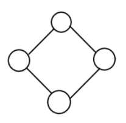
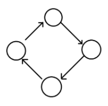
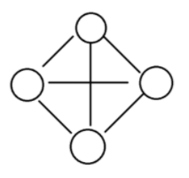

# 그래프 (Grpah)

## 1. 그래프란?

> 정점과 간선으로 이루어진 자료구조

## 2. 용어

- 정점 : 노드라고도 하며, 데이터가 저장되어있는 공간
- 간선 : 정점과 정점을 잇는 선, 노드와의 관계를 나타냄
- 인접 정점 : 간선에 의해 연결된 정점
- 단순 경로 : 같은 간선을 지나가지 않는 경로
- 차수 : `무방향 그래프`에서 하나의 정점에 인접한 정점의 수
- 진출 자수 : `방향그래프`에서 사용되는 용어로 한 노드에서 외부로 향하는 간선의 수
- 진입 차수 : `방향그래프`에서 사용되는 용어로 외부 노드에서 들어오는 간선의 수

## 3. 그래프 구현 방법 : 인접행렬 방식 vs 인접리스트 방식

- 인접 행렬

  1. 구현 방법

     - 그래프의 노드를 2차원 배열로 만든 것
     - 한 노드가 다른 노드에 인접하다면 1, 아니면 0을 넣는다.

  2. 장점

     - 2차원 배열에 모든 정점들의 간선 정보를 담기 때문에 배열의 위치를 확인하면 두 점에 대한 연결 정보를 조회할 때 O(1)의 시간복잡도면 가능하다.
     - 구현이 간단하다.

  3. 단점
     - 모든 정점에 대해 간선 정보를 대입해야 하므로 O(n^2) 의 시간복잡도가 소요된다.
     - 2차원 배열이 필요하기에 필요 이상의 공간이 낭비됨

- 인접리스트 방식

  1. 구현 방법

     - 그래프의 노드들을 리스트로 표현한것
     - 각 정점을 리스트 배열을 만들어 관계를 설정함으로써 구현

  2. 장점

     - 정점들의 연결 정보를 탐색할 때 O(n) 의 시간이면 가능하다. (n: 간선의 갯수)
     - 필요한 만큼의 공간만 사용하기 때문에 공간의 낭비가 적다.

  3. 단점
     - 특정 두 점이 연결되었는지 확인하려면 인접행렬에 비해 시간이 오래 걸린다. (배열보다 search 속도느림)
     - 구현이 비교적 어려움

## 4. 그래프의 종류

- 무방향 그래프  
    
   간선에 방향이 없는 그래프

- 방향 그래프  
    
   간선에 방향이 존재하는 그래프

- 가중치 그래프  
    
   특정 간선을 통해 이동할 때 비용이 드는 그래프

- 완전 그래프  
    
   모든 정점 사이에 간선으로 연될되어 있는 그래프
