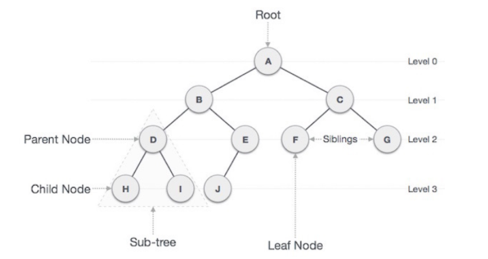
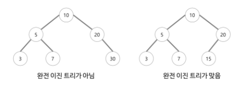

# 트리 (Tree)

## 1. 개념

> 사이클이 없고, 서로 다른 두 노드를 잇는 길이 하나뿐인 그래프

## 2. 특징

1. 트리는 하나의 부모 노드를 갖는다.
2. 부모 노드는 0개 이상의 자식 노드를 갖는다.
3. 비선형 자료구조이고 `계층 모델`이다.
4. 사이클이 존재할 수 없다.
5. 트리는 DAG(Directed Acyclic Graphs, 방향성이 있는 비순환 그래프)의 한 종류이다.
6. `노드가 N개`인 트리는 항상 `N-1개의 간선`을 갖는다.
7. 임의의 두 노드 간의 `경로는 유일하다`.
8. 순회는 `Pre-order`, `In-order` 아니면 `Post-order`로 이루어진다. 이 3가지 모두 DFS/BFS 안에 있다.

## 3. 트리와 관련된 용어

- 루트 노드(Root node): 부모노드가 없는 노드, 최상위 노드
- 단말 노드(Leaf node): 자식노드가 없는 노드
- 간선(edge): 노드를 연결하는 선 (== link, branch)
- 형제 노드(Sibling node): 같은 부모노드를 가지는 노드
- 노드의 크기(Size): 자신을 포함한 모든 자식노드의 개수
- 노드의 깊이(Depth): 루트노드에서 어떤노드에 도달하기 위해 거쳐야하는 간선의 수
- 노드의 레벨(Level): 트리의 특정 깊이를 가지는 노드의 집합
- 노드의 차수(Degree): 하위 트리 개수 / 간선 수 = 각 노드가 지닌 가지의 수
- 트리의 차수(Degree of tree): 트리의 최대 차수
- 트리의 높이(Height): 루트 노트에서 가장 깊숙히 있는 노드의 깊이

## 4. 트리의 종류

- 이진 트리 (Binary tree)

  - 각 노드의 자식 노드의 개수가 최대 2개인 트리
  - 이진 트리 순회
    1. 중위 순회 (in-order traversal): 왼쪽 subtree -> 현재 노드 -> 오른쪽 subtree
    2. 전위 순회 (pre-order traversal): 현재 노드 -> 왼쪽 subtree -> 오른쪽 subtree
    3. 후위 순회 (post-order traversal): 왼쪽 subtree -> 오른쪽 subtree -> 현재 노드

- 이진 탐색 트리 (Binary search tree)

  - 왼쪽 서브트리에 존재하는 모든 노드 <= 현재 노드 <= 오른쪽 서브트리에 존재하는 모든 노드

- 완전 이진 트리 (Complete binary tree)
  - 마지막 레벨을 제외한 모든 레벨이 꽉 채워져 있어야함
  - 마지막 레벨은 왼쪽 부터 오른쪽 순서대로 채워져 있어야 한다.  
    

## 5. 그래프 vs 트리

|           | 그래프                                                    | 트리                             |
| --------- | --------------------------------------------------------- | -------------------------------- |
| 정의      | 노드와 그 노드를 연결하는 간선을 하나로 모아놓은 자료구조 | 그래프의 한 종류 (DAG의 한 종류) |
| 방향성    | 방향 그래프, 무방향 그래프 모두 존재                      | 방향 그래프                      |
| 사이클    | 존재할 수 있음                                            | 존재할 수 없음                   |
| 부모-자식 | 없음                                                      | 있음                             |
| 모델      | 네트워크 모델                                             | 계층 모델                        |
| 경로      | N개                                                       | 1개                              |
| 간선의 수 | >= 0                                                      | N-1 (N개의 노드)                 |
